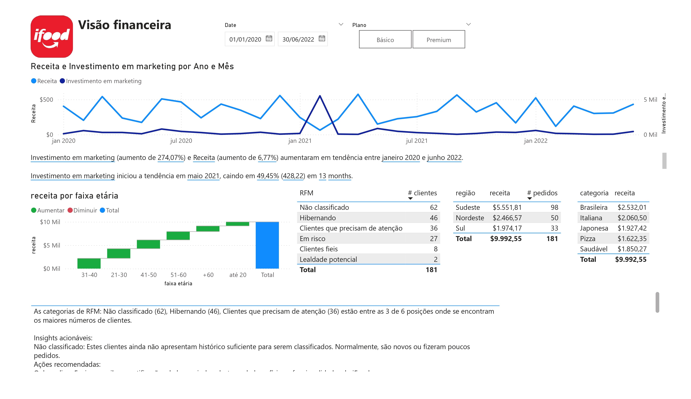
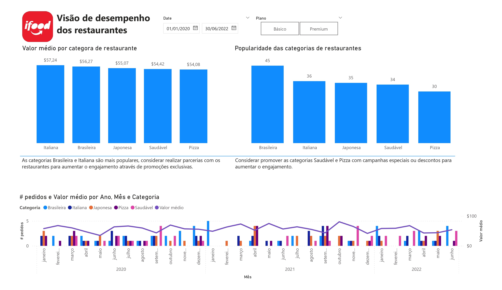
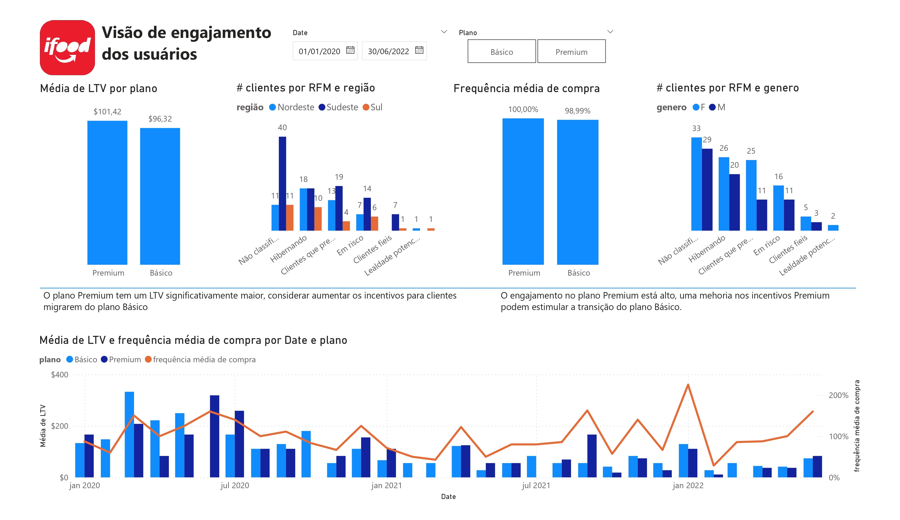

# iFood Business Intelligence Challenge 🚀

Este projeto aborda um desafio de Business Intelligence (BI) com foco na análise de retenção de clientes e identificação de oportunidades de crescimento para o Clube iFood. O objetivo é fornecer insights valiosos por meio de KPIs, segmentações e visualizações em Power BI, visando aprimorar a experiência do cliente e impulsionar o crescimento.

---

## 📑 Descrição do Projeto

Este projeto utiliza um dataset fictício de clientes do iFood para realizar análises avançadas sobre churn, retenção e engajamento. Através de técnicas de BI, foram criados KPIs e segmentações para entender o perfil dos clientes, identificar oportunidades de melhoria e propor ações estratégicas para aumentar o valor do ciclo de vida do cliente (LTV) e reduzir o custo de aquisição de clientes (CAC).

---

## Screenshots

**Painel Power BI**








---

## 📊 Objetivo

1. **Análise de Churn e Retenção**: Identificar clientes de alto valor com baixa retenção e sugerir ações para reter esse público.
2. **Categorias Populares e Menos Populares**: Analisar as categorias de restaurantes para entender preferências e propor categorias a serem promovidas.
3. **Avaliação de Planos Premium e Básico**: Comparar o impacto dos planos no LTV e engajamento dos clientes para sugerir melhorias.

---

## 📈 Conclusão

Este projeto revela que clientes de alto valor muitas vezes apresentam baixa retenção, indicando uma oportunidade de retenção através de campanhas de reativação. A análise de categorias sugere que investir em restaurantes de categorias menos populares pode gerar novas oportunidades de crescimento. Além disso, a análise dos planos demonstra que o plano Premium aumenta o engajamento e o LTV, mas melhorias podem ser implementadas para ampliar ainda mais o impacto.

---

## 🛠 Estrutura do Projeto

- **Arquivo de Dados**: `iFood_BI_Desafio_Dataset.xlsx`
- **Ferramentas Utilizadas**: Python (para processamento e geração de dados), Power BI (para visualização de KPIs e dashboards)
- **KPIs e Métricas**:
  - LTV (Lifetime Value)
    - (ticket médio x # compras por cliente x tempo de relacionamento)
  - CAC (Customer Acquisition Cost)
    - (custo campanha/ # novos planos)
  - Taxa de Churn
    - ( # desistentes / # clientes no mês )
  - Taxa de Retenção
    - ( # clientes no mês - # clientes desistentes) / # clientes no mês
  - Engajamento e Frequência de Compra
    - \# frequêcia de transações

---

## 🚀 Passo a Passo de Execução do Projeto

1. **Clone este repositório**:
   ```bash
   git clone https://github.com/pedrolporto/ifood_data_analysis.git
   cd ifood_data_analysis
   ```

2. **Instale as dependências**:

    Certifique-se de ter o jupyter notebook, pandas, numpy, seaborn, matplotlib e sklearn instalados para processar os dados em python:
    ```bash
    pip install notebook
    pip install pandas numpy seaborn matplotlib sklearn
    ```

    Para execução de arquivos python (.ipynb) abre o cmd e execute o jupyter notebook
    ```bash
    jupyter notebook
    ```
   

3. **Importe o Arquivo no Power BI**:
    - Abra o Power BI Desktop.
    - Importe o arquivo Dashboard_Power_BI.pbix
    - Conecte-se às tabelas caso queira atualizar os dados e siga os passos do painel de dados para gerar as visualizações dos KPIs.

4. **📂 Descrição do Arquivo Gerado**:

    O arquivo iFood_BI_Desafio_Dataset_Atualizado.xlsx contém as seguintes colunas:
    - valor_gasto: Total gasto pelo cliente.
    - tempo_vida_dias: Tempo de vida do cliente em dias.
    - ltv: Lifetime Value calculado.
    - cac: Custo de aquisição.
    - frequencia_compra: Número de compras realizadas.
    - data_ultima_transacao: Data da última compra.
    - plano: Tipo de plano (Básico/Premium).
    - categoria_favorita: Categoria de restaurante mais frequentada.
    - score_engajamento: Indicador de engajamento.
    - status_churn: 0 = não churn, 1 = churn.

Esse arquivo foi projetado para facilitar a atualização de KPIs mensais e realizar análises avançadas sobre retenção, churn e segmentação de clientes.

---

5. 🔄 **Atualização Mensal dos KPIs**

    Para automatizar a atualização mensal dos KPIs:
    - Execute o script atualizar_kpis.py no início de cada mês para atualizar o arquivo Excel com os novos dados.
    - Agende uma tarefa automática (via cron ou Task Scheduler) para executar o script e atualizar o arquivo conforme necessário.
    - Recarregue os dados no Power BI para atualizar os dashboards.

6. 📈 **Plano de Melhoria Contínua**

    Para adaptar-se às mudanças do mercado e aprimorar o Clube iFood, recomenda-se revisar periodicamente os seguintes pontos:
    - Churn e Retenção: Avaliar a eficácia de campanhas de reativação.
    - Engajamento por Plano: Monitorar o impacto das melhorias nos planos Premium e Básico.
    - Novas Oportunidades de Categorias: Realizar análises de categorias com baixa demanda para avaliar o potencial de crescimento.
    - CAC x LTV: Acompanhar a relação entre CAC e LTV para garantir a viabilidade financeira.

 ---

📧 **Contato**

Para mais informações sobre o projeto ou para dúvidas, entre em contato:

Nome: Pedro Porto
- [\[ LinkedIn\]](https://www.linkedin.com/in/pedro-porto-0ba678a2/)
- [@pedrolporto](https://www.github.com/pedrolporto)

---

Projeto desenvolvido como parte de um desafio de Business Intelligence para análise de clientes e retenção. Todos os dados são fictícios e foram gerados para fins educacionais.